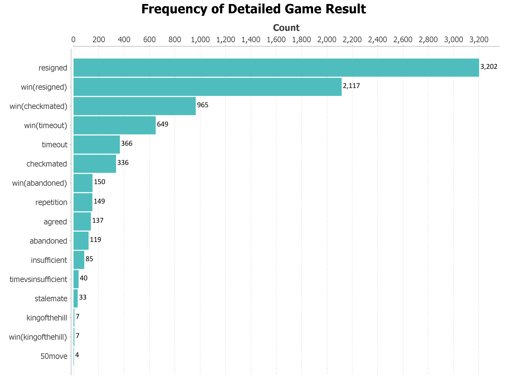
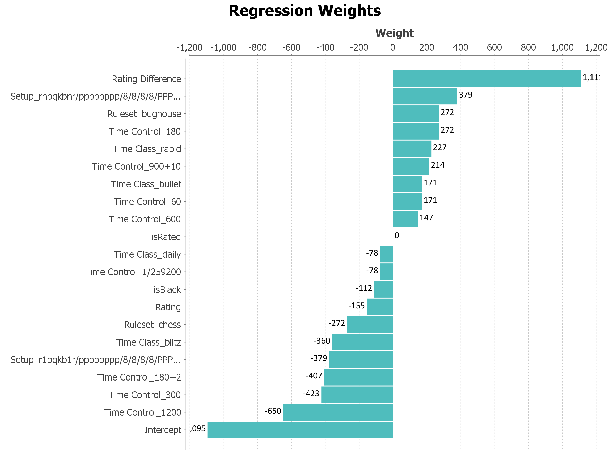
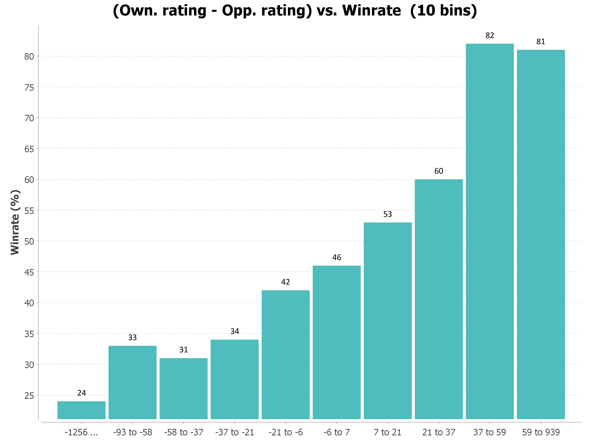

# Chess Analyzer

A Java based command line tool for downloading, parsing, and analyzing game histories from Chess.com. Extracts player statistics, constructs visualization charts, and applies machine learning to identify key factors impacting game outcomes.

## Features

### Data Collection
Downloads all game history from the Chess.com API and compiles it into a clean CSV format (saved to `./data/<username>/`).

### Statistical Visualization
Generates bar charts, displaying metrics such as:
  - Frequency of rulesets, time controls, and time classes.
  - Game results (detailed by win/loss methods).
  - Rating difference versus win rate.

<p align="center">
    
</p>

### Machine Learning Analysis
Trains a logistic regression classifier on game features (rating difference, color, ruleset, etc.) and visualizes the predictive weight of each variable.

<p align="center">
    
</p>

### Correlation Testing
Generates histograms and computes point-biserial correlation coefficients, supports direct correlation comparison between two players.

<p align="center">
    
</p>

## Getting Started

### Dependecies
- Java 25
- Maven (If building yourself)

### Run Directly
A pre-built shaded jar is included in the project root. You can put it into an empty folder and run it immediately:
```bash
java -jar chess-analyzer.jar [ARGS]
```

### Building the Project
Alternatively, to compile the source code and create the jar file, run the following:
```bash
mvn clean package
```
The jar will be located in the `./target` directory.

## Reference

### `collect`
Collects historical games for a player and saves them as a CSV dataset. *This may take a minute*
```bash
java -jar chess-analyzer.jar collect <username>
```
- **Arguments:** `<username>` (Chess.com player username)

### `analyze`
Generates simple or complex frequency charts of game variables.
```bash
java -jar chess-analyzer.jar analyze <username> [-s] [-c] [-a]
```
- **Options:**
  - `-s`, `--simple`: Runs simple frequency analyses (ruleset, result, color, time class, etc.).
  - `-c`, `--complex`: Prompts for a variable and a value to filter by (e.g., filtering outcomes by a specific time control). *\*Temporarily unstable*
  - `-a`, `--all`: Runs both analyses.

### `regression`
Trains a logistic regression model on the player's history to analyze how much game variables (color, rating gap, format) influence wins.
```bash
java -jar chess-analyzer.jar regression <username>
```
- Outputs training accuracy to the console and saves regression weights as a chart.

### `correlate`
Analyzes the correlation between rating difference (Own - Opponent rating) and win rate.
```bash
java -jar chess-analyzer.jar correlate <username> [<username2>] [<binCount>] [-c]
```
- Outputs and saves histogram
- **Options:**
  - `-c`, `--compare`: Compares correlation values between two players without plotting.
- **Arguments:**
  - `<username2>`: Second username for comparison (used if `-c` is passed).
  - `<binCount>`: Number of bins for the histogram (defaults to 10).

### `delete`
Deletes saved player data or visualizations.
```bash
java -jar chess-analyzer.jar delete <username> [-a]
```
- **Options:**
  - `-a`, `--all`: Deletes the entire player data directory (CSV + visualizations). Default deletes only the visualizations folder.

## Output Data Structure

Data and visualizations structured in local directory:
```text
data/
└── <username>/
    ├── <username>.csv                # Compiled Chess.com games
    └── visualization/
        ├── simple frequency/        # Ruleset, results, time class charts
        ├── complex frequency/       # Filtered game statistics
        ├── correlation/             # Histograms and Point-Biserial results
        └── regression/              # Trained Logistic Regression coefficients
```